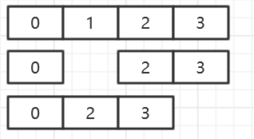

[TOC]

# Go ABC

## 1. hello-world

开始之前我们需要做一些准备工作：

1. 下载安装go

2. 设置GOPATH

   ```
   +--gopath
   |  +--bin
   |  +--pkg
   |  +--src
   +-....
   ```

3. 将GOPATH设置到环境变量中

   ```shell
   GOPATH=path/to/gopath
   PATH=$PATH:$GOPATH
   ```


准备工作结束后，就可以开始我们第一个go应用了，在src目录下新建我们的工程goabc。

```
+--gopath
|  +--bin
|  +--pkg
|  +--src
|  |  +--goabc
|  |  |  +--hello.go
+-...
```

- bin目录下放的是可执行文件，pkg目录下放的是.a或.so的库文件，src目录下放置源码

在`hello.go`中输入如下内容：

```go
package main

func main(){
    println("hello world")
}
```

在`goabc`文件夹下执行`go build`，即可得到名称为hello的可执行文件。执行`go install`，将可知行文件安装到`gopath/bin`目录下。

- 只有package name为main的包才可被编译为可执行文件，该包下的`main`函数为主函数。

## 2. import & package

### import

```
+--gopath
|  +--bin
|  +--pkg
|  +--src
|  |  +--goabc
|  |  |  +--hello.go
|  |  +--goabc-link
|  |  |  +--importme.go
+-...
```

在`importme.go`中输入如下内容：

```go
package goabc_link

func Echo() string {
	return "you have imported me"
}
```

在`hello.go`中加入如下内容

```go
package main

import (
	"goabc-link" //该包相对于gopath/src的相对路径，gopath/src/goabc-link
)

func main(){
	println(goabc_link.Echo())
}

```

-  go会在goroot/vendor/gopath下找这个包是否存在，排在前面的优先级高。

将hello.go改写为：

```go
package main

import (
	"goabc-link" //该包相对于gopath/src的相对路径，gopath/src/goabc-link
)

func main(){
     println("hello world")
}
```

再次编译，将引起编译错误

- 没有使用到的包出现在import中会引编译报错，解决办法

  1. 删掉无用的package，可使用工具`go fmt`或`go import`，自动格式化go工程或文件

  2. 将无用包改为匿名包，如下所示：

     ```go
     import (
     	_ "goabc-link" 
     )
     ```

### package

- 在同一目录下的文件隶属于同一个package，如下图中的hello.go和samepackage.go都属于package main。

  ```
  +--gopath
  |  +--bin
  |  +--pkg
  |  +--src
  |  |  +--goabc
  |  |  |  +--hello.go
  |  |  |  +--samepackage.go
  +-...
  ```

- golang中大写开头的变量，方法，函数是包外可见的，反之只有包内可见。

  ```go
  package goabc_link
  
  func echo() string {
  	return "you have imported me"
  }
  
  ```

  将goabc_link中的`Echo`方法改为`echo`，再次编译hello.go会引起编译报错。

## 3. slice & map

### map

- 简单使用

  ```go
  func TestMap(){
      Roster := make(map[string]string,0) //初始化
      //Roster2 := map[string]int{"bob":1, "bob2":2}
      Roster["bob"]="01"    //插入数据
      printBob()
      Roster["bob"]="02"    //修改数据
      printBob()
      delete(Roster, "bob") //删除数据
  }
  func printBob(){
      value,ok := Roster["bob"]  //查询数据
      if ok{
          print("bob is "+Roster["bob"])
      }else{
          print("There is no bob")
      }
  }
  ```

- 初始化参数对性能的影响

  map的初始化使用的是make方法申请内存，make方法第一个参数是申请内存的类型，第二个参数是所要申请的容量。

  对于map/slice而言，当使用的容量超过申请的容量时，该容量是可以自动扩容的，但是自动扩容的机制会带来一定的性能损耗。因此，在已知容量为n的情况下，应使用`make(map[{key_type}]{value_type},n)`在初始化时为map申请足够内存，避免扩容开销。

  ```go
  //未指定容量
  func Mapinit(){
  	Roster := make(map[string]string,0)
  	for i:=0;i<100;i++{
  		Roster["bob"+strconv.Itoa(i)] = strconv.Itoa(i)
  	}
  }
  func BenchmarkMapinit(t *testing.B) {
  	for i := 0; i < t.N; i++ {
  		Mapinit()
  	}
  }
  
  //指定容量
  func Mapinit2(){
  	Roster := make(map[string]string,100)
  	for i:=0;i<100;i++{
  		Roster["bob"+strconv.Itoa(i)] = strconv.Itoa(i)
  	}
  }
  func BenchmarkMapinit2(t *testing.B) {
  	for i := 0; i < t.N; i++ {
  		Mapinit2()
  	}
  }
  ```

  压测结果：

  ```
  BenchmarkMapinit-8    	  100000	     16067 ns/op
  BenchmarkMapinit2-8   	  200000	      9674 ns/op
  ```

### slice

- 简单使用

  ```go
  func TestSlice() {
  	array := make([]int, 0)  //初始化
  	array = append(array, 0) //增加元素
  	printSlice(array)
  	array2 := []int{1, 2, 3}
  	array = append(array, array2...) //合并切片
  	printSlice(array)
  	array3 := array[1:3] //截取切片
  	printSlice(array3)
  	array = append(array[:1], array[2:]...) //删除元素
  	printSlice(array)
  }
  func printSlice(array []int) {
  	for i := range array {
  		print(array[i], ",")
  	}
  	println()
  }
  ```

删除元素是截取切片和合并切片的组合操作：



需要注意的时，当使用`make([]struct{},n)`，n不为0时，`array[0],...,array[n]`均为该类型的初始化值。


## 5. 条件和循环

### 条件

```go
func printBob(){
    value,ok := Roster["bob"]  //查询数据
    if ok{
        print("bob is "+Roster["bob"])
    }else{
        print("There is no bob")
    }
}
```

### 循环

```go
for i:=0i<100;i++{
    println(i)
}

//遍历切片
slicex := make([]int,100)
for index := range slicex{
    slicex[index] = index
}
for _,value := range slicex{
    println(v)
}

//遍历map
mapx := map[string]int{"a": 1, "b": 2, "c": 3}
for k,v := range mapx {
    println(k,v)
}
```

## 6.函数和方法

### 函数

- 函数的返回值可以定义多个

```go
func testFunc(args []string)(int, string){
    return 1,"1"
}
```

- 函数是golang的第一公民，可以作为参数，成员，变量....

```go
func main(){
    f := testFunc //将函数赋值给本地变量
    doFunc(f)//函数作为入参
}

func doFunc(f func([]string)(int, string)) string {
	_,v := f([]string{})
	return v
}
```

### 方法

方法和函数类似，不同点在于方法是属于某个对象的函数。go中的函数相当于java中的静态方法，go中的方法相当于java中的非静态方法。

- 在go中定义一个对象

  ```go
  type User struct{
      Name string //结构体的成员，同样以大小写区分可见性
      age  int
  }
  ```

- 为该结构体添加方法

  ```go
  func (u *User)Say()string{
      return "I am " + u.Name
  }
  ```

- 调用方法

  ```go
  func main(){
      b := &User{     //结构体的初始化
          Name: Bob，
          age： 3，
      }
      println(b.Say())
  }
  ```

## 7. goroutine & channel

### goroutine

让我们先来写一个快排：

```go
func QuickSort01(array []int) {
	if len(array) == 1 || len(array) == 0 || array == nil {
		return
	}
	key := array[0]
	r := len(array) - 1
	l := 1
	for r != l {
		if array[l] > key {
			swap(&array[r], &array[l])
			r--
		} else {
			l++
		}
	}
	if array[r] > key {
		swap(&array[0], &array[r-1])
	} else {
		swap(&array[0], &array[r])
	}
	QuickSort01(array[:r])
	QuickSort01(array[r:])
	return
}

func swap(a *int, b *int) {
	temp := *a
	*a = *b
	*b = temp
}
```

跑一下benchmark，看一下这个单线程的快排性能如何：

```
BenchmarkQuickSort1000-4       	   30000	     44133 ns/op
BenchmarkQuickSort10000-4      	    2000	   1037000 ns/op
BenchmarkQuickSort100000-4     	      30	  39333333 ns/op
BenchmarkQuickSort1000000-4    	       1	3298000000 ns/op
```

**goroutine：go语言最大特色之一**，是go支持高并发的关键所在。routine也称为协程，暂时可以理解为轻量级的线程，协程栈极小，初始为`2k`，因此可以被大量创建。可以说，go在语言层面实现了一种支持调度的线程池，在需要并发时，只需使用关键字`go`，将方法作为一个`goroutine`提交给go的调度器即可。

- 简单使用

```go
func testGo(){
    go doPlus(1,1)
}
func doPlus(a,b int)int{
    time.Sleep(10000)
    return a+b
}
```

改写我们的快排，让它变成并发快排

```go
var Waitgroup = sync.WaitGroup{}

func main(){
    array := make([]int,100)
	for i:= range array{
		array[i] = rand.Intn(100)
	}
    Waitgroup.Add(1) 
	QuickSort02(array)
	Waitgroup.Wait() //需要做同步，等待排序完成
}

func QuickSort02(array []int) {
	if len(array) == 1 || len(array) == 0 || array == nil {
		Waitgroup.Done()
		return
	}
	key := array[0]
	r := len(array) - 1
	l := 1
	for r != l {
		if array[l] > key {
			swap(&array[r], &array[l])
			r--
		} else {
			l++
		}
	}
	if array[r] > key {
		swap(&array[0], &array[r-1])
	} else {
		swap(&array[0], &array[r])
	}
	Waitgroup.Add(2)
	go QuickSort02(array[:r])
	go QuickSort02(array[r:])
	Waitgroup.Done() 
}
```

并发快排的性能：

```
BenchmarkQuickSortS1000-4      	   10000	    200700 ns/op
BenchmarkQuickSortS10000-4     	    1000	   2035000 ns/op
BenchmarkQuickSortS100000-4    	      50	  28820000 ns/op
BenchmarkQuickSortS1000000-4   	       1	1318000000 ns/op
```

可以看到，在排序数目较少时，并发快排性能是不如单线程快排的，因为创建协程的开销大过了排序计算的开销。当排序数目增大时，并发优势就显现出来了。值得注意的是，当排序数目到达100w时，goroutine的数量会达到200w+，如果是java早就应该出现了OOM错误了，但是go是可以做到支持百万协程并发作业。

### channel

channel也是go语言的一大特色，channel抽象了协程通信的过程，使得协程间的数据交互变得更加方便。

- 简单用法

  ```go
  func testGo(){
      req := make(chan int) //初始化一个channel
      go doPlus(1,1,req)
      println(<-req) //读取channel中的内容，该过程会阻塞当前协程直到获得内容
  }
  func doPlus(a,b int, req chan int){
      time.Sleep(10000)
      req <- a+b //向channel中输入结果
      close(req) //发送完成关闭channel
  }
  ```

- 监听多个channel的多路复用处理器

  ```go
  func Process(){
  	stop := time.NewTimer(30*time.Second)
  	chr := make(chan string)
  	chn := make(chan string)
      //从标准输入读取
  	go readin(chr)
      //从网络读取
  	go readNet(chn)
  	for{
  		select {
  		case <-stop.C:
  			break
  		case s,ok:=<-chr:
  			if ok{
  				println(s)
  			}
  		case s,ok:=<-chn:
  			if ok{
  				println(s)
  			}
  		}
  	}
  }
  
  func readin(ch chan string){
  	var input string
  	fmt.Scanln(&input)
  	ch <- input
  	close(ch)
  }
  
  func readNet(ch chan string){
  	defer close(ch)
  	socket, err := net.ListenUDP("udp4", &net.UDPAddr{
  		IP:   net.IPv4(127, 0, 0, 1),
  		Port: 8080,
  	})
  	if err != nil {
  		fmt.Println("监听失败!", err)
  		return
  	}
  	defer socket.Close()
  
  	data := make([]byte, 4096)
  	_, _, err = socket.ReadFromUDP(data)
  	if err != nil {
  		fmt.Println("读取数据失败!", err)
  	}
  	ch <- string(data[:])
  }
  ```

- 优雅的关闭channel

  https://go101.org/article/channel-closing.html


## 8. interface & 类型断言

### interface

interface是go类型系统中的重要一环，总所周知，go是不存在继承关系的，如何写一个可以适配多个类的方法，这就要用到interface。

- 定义interface，与java非常相似

  ```go
  type Person interface{
      Say()string   //该接口的方法
  }
  ```

- 组合接口

  ```go
  type Programer interface{
      Person
      Debug()
  }
  ```

- 实现接口

  golang中实现接口不需要显示声明，只要实现了接口定义的方法即可。例如，这个Bob同学，他只要实现了Say的方法，就可以认为他是一个Person了，同时他也实现了Debug方法，所以在Go看来他已经是一个合格的程序员了。

  ```go
  type Bob struct{
  }
  func (*Bob)Say()string{
      return "I am Bob"
  }
  func (*Bob)Debug(){
      println("I can debug")
  }
  ```

- 使用interface

  ```go
  func doDebug(p Programer){
      p.Debug()
  }
  
  func main(){
      bob := &Bob{}
      doDebug(bob) //如此，在需要programer的地方，我们就可以派遣bob同学去了
  }
  ```

### 类型断言

类型断言可以将interface对象转型为实现interface的对象类型来使用，回到我们之前的例子，假如doDebug方法想知道到底是谁给自己打工，怎么办？

```go
func doDebug(p Programer){
    switch m:=p.(type){
	case *Bob:
		println("This is Bob")
        m.Debug()
	default:
		println("I don't konw who")
	}
}
```

这里的`m`已经被转换成了`Bob`类型。需要注意的是调用interface的方法是要比调用固定类型的方法性能差很多的，我们改写dodebug，将`m.Debug`改为`p.Debug`

```go
func doDebug(p Programer){
    switch m:=p.(type){
	case *Bob:
		println("This is Bob")
        p.Debug()
	default:
		println("I don't konw who")
	}
}
```

改写前：

```
BenchmarkDoDebug-4   	  300000	      5890 ns/op
```

改写后：

```
BenchmarkDoDebug2-4   	   10000	    185300 ns/op
```

差距非常明显~，因为调用interface的方法相当于调用c++中虚函数的方法，是要在interface下的函数表中找到真正要调用的方法是哪个。因此在做了类型断言之后，尽可能的用断言类型的方法取代interface的方法。

## 9. 下节预告

part2：运行时调度

....


