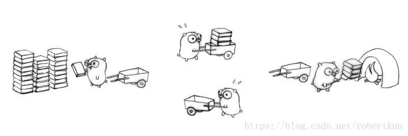

# 运行时调度

goroutine的高并发能力与其背后的调度器息息相关，这一章我们就来了解一下go的调度机制~同时，在本章的最后一节会介绍一个Go并发调优的大杀器go trace来帮助大家更好的学习go的调度！！！

## 1. 砖头，小车与Gopher -- go的调度模型

在山的那边海的那边有一群勤劳的Gopher，他们日以继夜的干一件事情----搬砖。



搬砖这件看似简单的事情背后到底隐藏的什么怎么会和go的调度模型扯上关联？这时候我们不妨先来一发哲学三连。

搬的什么？-- 砖

谁在搬？ -- gopher

用什么搬的？-- 小推车

当大家机智的回答出这些问题的时候，恭喜你对go的调度模型已经有一个初步的认识了。假如这些砖是golang世界中的一个个goroutine，那么gopher搬砖的过程就是调度goroutine的过程，再来一发哲学三连，来扯出我们这一章的三大主角

调度的什么？--- g : 它就是大名顶顶的goroutine

谁在执行调度？--- m : 给我们打黑工的苦逼线程

用的什么调度？ --- p : 线程执行的goroutine队列

可以在`runtime/runtime2.go`中看到三大主角的原貌，在这里我们将它们简化一下便于理解：

```go
//g本质上是维护了一个协程栈
//被运行的g会和执行他的m关联上
type g struct {
	stack          stack   // offset known to runtime/cgo
    sched          gobuf   // 当发生调度时，保存现场，记录了当前运行的pc和sp
    atomicstatus   uint32  // 当前goroutine的状态
	m              *m      // current m; offset known to arm liblink
    //preempt是抢占标志位，m在执行g时会查看该标志位，以决定是否中断当前任务
	preempt        bool    // preemption signal, duplicates stackguard0 = stackpreempt
}

//m有自己线程栈（g0栈），当前运行的g，以及一个p（goroutine队列）
//m可以脱离p运行当m执行的不是go代码的时候
type m struct {
	g0            *g       // goroutine with scheduling stack
	procid        uint64   // for debuggers, but offset not hard-coded
	curg          *g       // current running goroutine
	p             puintptr // attached p for executing go code (nil if not executing go
	park          note
}

// p本质上是一个goroutine队--runq ，容量为256。
// 一个状态正常的p是需要与m绑定的
// 当前goroutine产生出来的子goroutine会被放在runnext中而非队尾
type p struct {
    m           muintptr   // back-link to associated m (nil if idle)
	// Queue of runnable goroutines. Accessed without lock.
	runqhead uint32
	runqtail uint32
	runq     [256]guintptr
	// runnext, if non-nil, is a runnable G that was ready'd by
	// the current G and should be run next instead of what's in
	// runq if there's time remaining in the running G's time
	// slice. It will inherit the time left in the current time
	// slice. If a set of goroutines is locked in a
	// communicate-and-wait pattern, this schedules that set as a
	// unit and eliminates the (potentially large) scheduling
	// latency that otherwise arises from adding the ready'd
	// goroutines to the end of the run queue.
	runnext guintptr
}
```

有了小车，gopher就可以开开心心的搬起砖来了...这时候第一个问题来了，作为黑心老板的我们想要榨干gopher的劳动力，不停的大量制造goroutine扔到gopher的小车子里，但是gopher的小车p只能放下256块砖，怎么办，这时候我们需要一个全局的goroutine队列。

```go
type schedt struct {
    //...
	// Global runnable queue.
	runqhead guintptr
	runqtail guintptr
	runqsize int32
    //...
}
```

当gopher车子中goroutine被堆满时，gopher会将车中一半的goroutine都扔到全局队列中。

`runtime/proc.go--func findrunnable()`

这时候勤劳的gopher夜以继日幸苦劳作终于把车中的goroutine都执行完了，这时候，它想起来还有一部分goroutine被自己扔在了全局队列中，于是它又跑去全局队列中拿goroutine，那么它应该拿多少goroutine呢？机智的gopher掐指一算，拿走了n个goroutine放到了自己小车中。`n := sched.runqsize/gomaxprocs + 1`.（n大于256则取256）。

终于有一天，gopher发现连全局队列里的goroutine都被拿完了，gopher感觉自己已经到达了人生的巅峰终于可以安度晚年的。这时，另一个gopher推着小车经过了它的身边，善良而又勤劳的gopher想，虽然自己已经可以功成身退了，但是自己的兄弟们还在水深火热的境地中搬砖，于是它又推起了小车，偷偷的将刚刚那个gopher车里一半的砖放到了自己车里...

```go
// Steal half of elements from local runnable queue of p2
// and put onto local runnable queue of p.
// Returns one of the stolen elements (or nil if failed).
func runqsteal(_p_, p2 *p, stealRunNextG bool) *g {
	t := _p_.runqtail
	n := runqgrab(p2, &_p_.runq, t, stealRunNextG)
	if n == 0 {
		return nil
	}
	n--
	gp := _p_.runq[(t+n)%uint32(len(_p_.runq))].ptr()
	if n == 0 {
		return gp
	}
	h := atomic.Load(&_p_.runqhead) // load-acquire, synchronize with consumers
	if t-h+n >= uint32(len(_p_.runq)) {
		throw("runqsteal: runq overflow")
	}
	atomic.Store(&_p_.runqtail, t+n) // store-release, makes the item available for consumption
	return gp
}
```

m会从其他m的p的队尾偷取一半的goroutine，以避免锁操作。

终于有一天，该搬的砖搬完了，不该搬的砖也偷不到了，gopher可以去休息了么？不一定，它有可能把小车放一旁被任命为负责值班的gopher--`spining m`，什么情况下gopher会变成值班人员，它又要干些什么呢？

```go
	if !_g_.m.spinning && 2*atomic.Load(&sched.nmspinning) >= procs-atomic.Load(&sched.npidle) {
		goto stop
	}
	if !_g_.m.spinning {
		_g_.m.spinning = true
		atomic.Xadd(&sched.nmspinning, 1)
	}
```

当在运作的小车数量大于值班小车数量两倍的时候，没事干的gopher就会被派去值班，简单的来讲，有两个还在干活的gopher就至少会有一个值班gopher，以此类推。gopher被任命为值班者后会再次确认是否有还在干活的小伙伴们，是否有epoll任务是否有gc任务，如果有上述任务，那么值班gopher再次尝试working steal或者执行相关任务。

有些时候值班小哥发现自己去工作了就已经没有人值班了，这个时候它会唤醒一个已经休息的gopher成为新的值班者。

## 2. Go背后的故事

## 3. 上帝说要有光 -- main goroutine

## 4. Go程序的摄像机 -- go trace