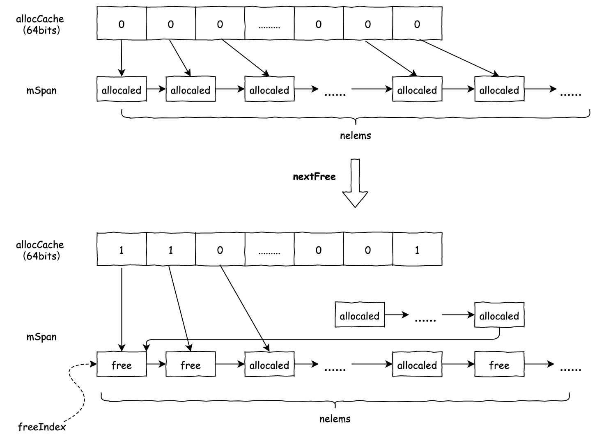
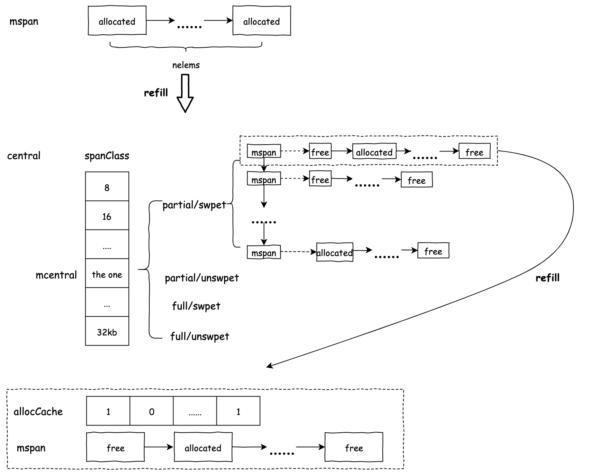
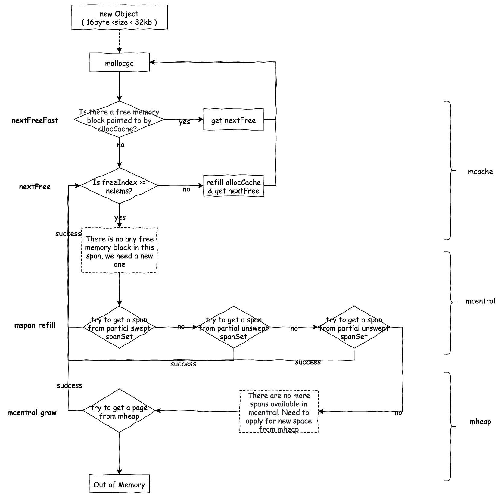
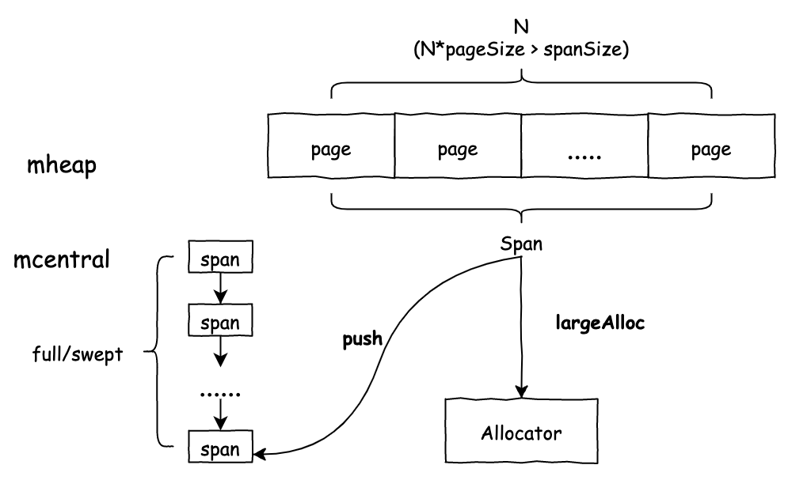
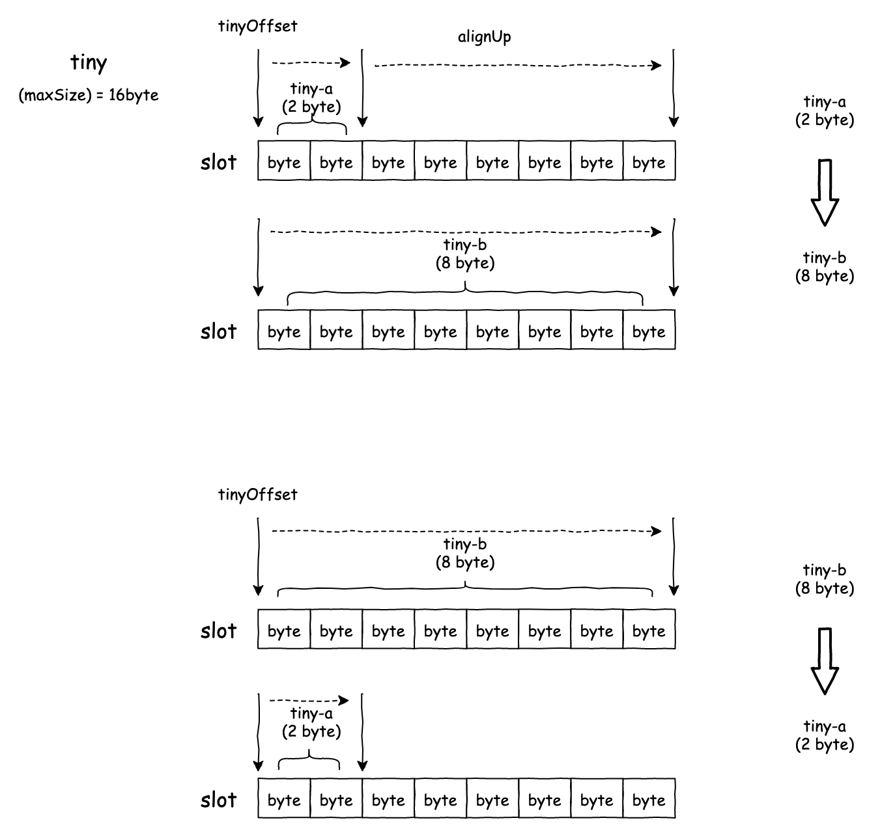
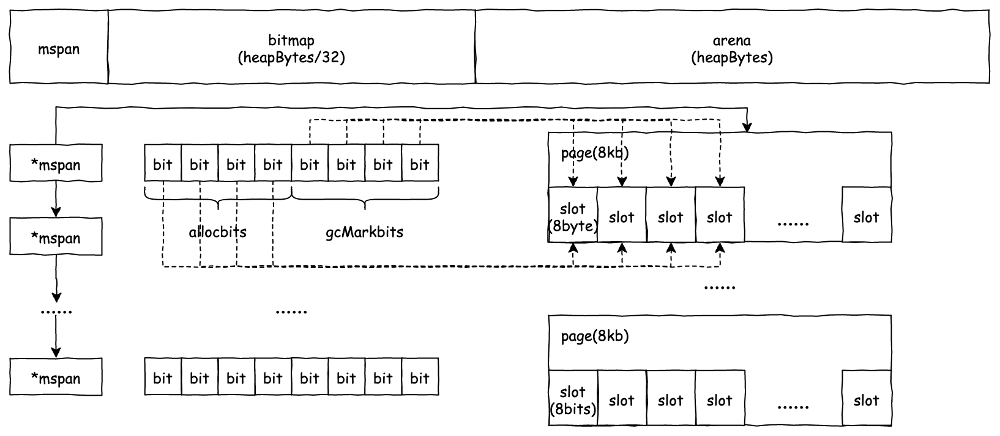
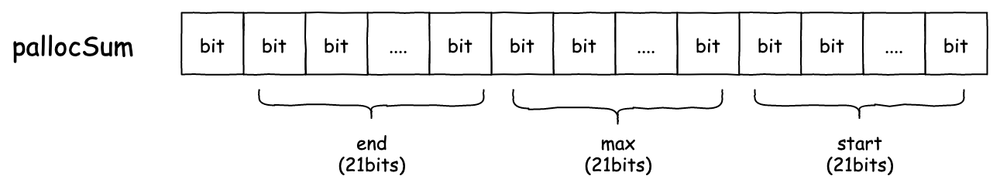
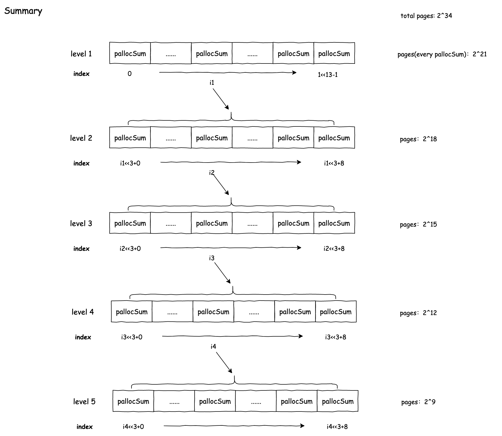

# 内存分配

### 1.1 TCmalloc

#### 1.1.1 TCmalloc简介

TCmalloc也称为Thread Cache malloc，其具有如下的特点：

1. 顾名思义，每个线程都拥有本地缓存，小对象优先从本地缓存，提高了小对象的分配效率。
2. 从操作系统申请的内存，通过划定特定大小的内存块（称为“Page”）进行管理。同时某个特定的Page会被用于特定大小的对象分配（在TCMalloc中称为“Span”）。这种方式可以消除内存的碎片化，同时简化了申请和释放内存的操作。

在了解tcmalloc在golang中的实现之前，需要了解如下几个概念：

##### mcache

 golang中线程的本地缓存，小于32kb的对象将优先从此块区域分配。其中alloc成员维护了一系列不同大小的span，并以spanClass（spanClass同时也是span所管理的内存块大小索引，spanClass与内存块大小的映射关系，见表1-1）作为索引。例如，申请16byte大小的对象，就会从alloc[2]中分配。对于更小的非指针对象，则由tiny指针所指向的内存空间中分配。

```go
type mcache struct {
   // The following members are accessed on every malloc,
   // so they are grouped here for better caching.
   nextSample uintptr // trigger heap sample after allocating this many bytes
   scanAlloc  uintptr // bytes of scannable heap allocated

   // Allocator cache for tiny objects w/o pointers.
   // See "Tiny allocator" comment in malloc.go.

   // tiny points to the beginning of the current tiny block, or
   // nil if there is no current tiny block.
   //
   // tiny is a heap pointer. Since mcache is in non-GC'd memory,
   // we handle it by clearing it in releaseAll during mark
   // termination.
   //
   // tinyAllocs is the number of tiny allocations performed
   // by the P that owns this mcache.
   tiny       uintptr
   tinyoffset uintptr
   tinyAllocs uintptr

   // The rest is not accessed on every malloc.

   alloc [numSpanClasses]*mspan // spans to allocate from, indexed by spanClass

   stackcache [_NumStackOrders]stackfreelist

   // flushGen indicates the sweepgen during which this mcache
   // was last flushed. If flushGen != mheap_.sweepgen, the spans
   // in this mcache are stale and need to the flushed so they
   // can be swept. This is done in acquirep.
   flushGen uint32

}
```

##### mspan

指向一段连续内存（arena中的pages），这段内存被分割成固定大小的内存块（内存块的大小由spanClass决定）。当申请内存大于spanClass-1所包含的内存块的大小，且小于等于spanClass所包含的内存块的大小时，会由该mspan分配内存。可以由下表找到对应spanClass的span包含多少个page以及管理内存块的数目。

```go
// class  bytes/obj  bytes/span  objects  tail waste  max waste
//     1          8        8192     1024           0     87.50%
//     2         16        8192      512           0     43.75%
//     3         24        8192      341           8     29.24%
//     4         32        8192      256           0     21.88%
//     5         48        8192      170          32     31.52%
//     6         64        8192      128           0     23.44%
//     7         80        8192      102          32     19.07%
//     8         96        8192       85          32     15.95%
//     9        112        8192       73          16     13.56%
//    10        128        8192       64           0     11.72%
//    11        144        8192       56         128     11.82%
//    12        160        8192       51          32      9.73%
//    13        176        8192       46          96      9.59%
//    14        192        8192       42         128      9.25%
//    15        208        8192       39          80      8.12%
//    16        224        8192       36         128      8.15%
//    17        240        8192       34          32      6.62%
//    18        256        8192       32           0      5.86%
//    19        288        8192       28         128     12.16%
//    20        320        8192       25         192     11.80%
//    21        352        8192       23          96      9.88%
//    22        384        8192       21         128      9.51%
//    23        416        8192       19         288     10.71%
//    24        448        8192       18         128      8.37%
//    25        480        8192       17          32      6.82%
//    26        512        8192       16           0      6.05%
//    27        576        8192       14         128     12.33%
//    28        640        8192       12         512     15.48%
//    29        704        8192       11         448     13.93%
//    30        768        8192       10         512     13.94%
//    31        896        8192        9         128     15.52%
//    32       1024        8192        8           0     12.40%
//    33       1152        8192        7         128     12.41%
//    34       1280        8192        6         512     15.55%
//    35       1408       16384       11         896     14.00%
//    36       1536        8192        5         512     14.00%
//    37       1792       16384        9         256     15.57%
//    38       2048        8192        4           0     12.45%
//    39       2304       16384        7         256     12.46%
//    40       2688        8192        3         128     15.59%
//    41       3072       24576        8           0     12.47%
//    42       3200       16384        5         384      6.22%
//    43       3456       24576        7         384      8.83%
//    44       4096        8192        2           0     15.60%
//    45       4864       24576        5         256     16.65%
//    46       5376       16384        3         256     10.92%
//    47       6144       24576        4           0     12.48%
//    48       6528       32768        5         128      6.23%
//    49       6784       40960        6         256      4.36%
//    50       6912       49152        7         768      3.37%
//    51       8192        8192        1           0     15.61%
//    52       9472       57344        6         512     14.28%
//    53       9728       49152        5         512      3.64%
//    54      10240       40960        4           0      4.99%
//    55      10880       32768        3         128      6.24%
//    56      12288       24576        2           0     11.45%
//    57      13568       40960        3         256      9.99%
//    58      14336       57344        4           0      5.35%
//    59      16384       16384        1           0     12.49%
//    60      18432       73728        4           0     11.11%
//    61      19072       57344        3         128      3.57%
//    62      20480       40960        2           0      6.87%
//    63      21760       65536        3         256      6.25%
//    64      24576       24576        1           0     11.45%
//    65      27264       81920        3         128     10.00%
//    66      28672       57344        2           0      4.91%
//    67      32768       32768        1           0     12.50%
```

表1-1 spanClass与span各类属性的映射关系


```go
type mspan struct {
   next *mspan     // next span in list, or nil if none
   prev *mspan     // previous span in list, or nil if none
   list *mSpanList // For debugging. TODO: Remove.

   startAddr uintptr // address of first byte of span aka s.base()
   npages    uintptr // number of pages in span

   manualFreeList gclinkptr // list of free objects in mSpanManual spans

   // freeindex is the slot index between 0 and nelems at which to begin scanning
   // for the next free object in this span.
   // Each allocation scans allocBits starting at freeindex until it encounters a 0
   // indicating a free object. freeindex is then adjusted so that subsequent scans begin
   // just past the newly discovered free object.
   //
   // If freeindex == nelem, this span has no free objects.
   //
   // allocBits is a bitmap of objects in this span.
   // If n >= freeindex and allocBits[n/8] & (1<<(n%8)) is 0
   // then object n is free;
   // otherwise, object n is allocated. Bits starting at nelem are
   // undefined and should never be referenced.
   //
   // Object n starts at address n*elemsize + (start << pageShift).
   freeindex uintptr
   // TODO: Look up nelems from sizeclass and remove this field if it
   // helps performance.
   nelems uintptr // number of object in the span.

   // Cache of the allocBits at freeindex. allocCache is shifted
   // such that the lowest bit corresponds to the bit freeindex.
   // allocCache holds the complement of allocBits, thus allowing
   // ctz (count trailing zero) to use it directly.
   // allocCache may contain bits beyond s.nelems; the caller must ignore
   // these.
   allocCache uint64

   // allocBits and gcmarkBits hold pointers to a span's mark and
   // allocation bits. The pointers are 8 byte aligned.
   // There are three arenas where this data is held.
   // free: Dirty arenas that are no longer accessed
   //       and can be reused.
   // next: Holds information to be used in the next GC cycle.
   // current: Information being used during this GC cycle.
   // previous: Information being used during the last GC cycle.
   // A new GC cycle starts with the call to finishsweep_m.
   // finishsweep_m moves the previous arena to the free arena,
   // the current arena to the previous arena, and
   // the next arena to the current arena.
   // The next arena is populated as the spans request
   // memory to hold gcmarkBits for the next GC cycle as well
   // as allocBits for newly allocated spans.
   //
   // The pointer arithmetic is done "by hand" instead of using
   // arrays to avoid bounds checks along critical performance
   // paths.
   // The sweep will free the old allocBits and set allocBits to the
   // gcmarkBits. The gcmarkBits are replaced with a fresh zeroed
   // out memory.
   allocBits  *gcBits
   gcmarkBits *gcBits

   // sweep generation:
   // if sweepgen == h->sweepgen - 2, the span needs sweeping
   // if sweepgen == h->sweepgen - 1, the span is currently being swept
   // if sweepgen == h->sweepgen, the span is swept and ready to use
   // if sweepgen == h->sweepgen + 1, the span was cached before sweep began and is still cached, and needs sweeping
   // if sweepgen == h->sweepgen + 3, the span was swept and then cached and is still cached
   // h->sweepgen is incremented by 2 after every GC

   sweepgen    uint32
   divMul      uint16        // for divide by elemsize - divMagic.mul
   baseMask    uint16        // if non-0, elemsize is a power of 2, & this will get object allocation base
   allocCount  uint16        // number of allocated objects
   spanclass   spanClass     // size class and noscan (uint8)
   state       mSpanStateBox // mSpanInUse etc; accessed atomically (get/set methods)
   needzero    uint8         // needs to be zeroed before allocation
   divShift    uint8         // for divide by elemsize - divMagic.shift
   divShift2   uint8         // for divide by elemsize - divMagic.shift2
   elemsize    uintptr       // computed from sizeclass or from npages
   limit       uintptr       // end of data in span
   speciallock mutex         // guards specials list
   specials    *special      // linked list of special records sorted by offset.
}
```

##### mcentral

 span在mheap中的缓存，它的成员partial和full维护了span的列表，其中partial维护了有空余的span，full维护了没有空余的span。当mcache中的span被完全分配后，会被放入full所维护的spanSet中。当完成gc清扫后，有空余的span会被放入partial的spanSet中。

```go
type mcentral struct {
   spanclass spanClass

   // partial and full contain two mspan sets: one of swept in-use
   // spans, and one of unswept in-use spans. These two trade
   // roles on each GC cycle. The unswept set is drained either by
   // allocation or by the background sweeper in every GC cycle,
   // so only two roles are necessary.
   //
   // sweepgen is increased by 2 on each GC cycle, so the swept
   // spans are in partial[sweepgen/2%2] and the unswept spans are in
   // partial[1-sweepgen/2%2]. Sweeping pops spans from the
   // unswept set and pushes spans that are still in-use on the
   // swept set. Likewise, allocating an in-use span pushes it
   // on the swept set.
   //
   // Some parts of the sweeper can sweep arbitrary spans, and hence
   // can't remove them from the unswept set, but will add the span
   // to the appropriate swept list. As a result, the parts of the
   // sweeper and mcentral that do consume from the unswept list may
   // encounter swept spans, and these should be ignored.
   partial [2]spanSet // list of spans with a free object
   full    [2]spanSet // list of spans with no free objects
}
```

##### mheap

管理page的场所，当向mheap申请n个page时，mheap从pageAlloc中拆分出满足n个连续的page，当page被释放时，相邻且空余的page会被合并。我们会在后文详细介绍mheap分配page的过程。


#### 1.1.2 小对象的内存分配

##### 从mcache中快速分配

allocCache是一个64位的bitsmap，每一位都代表了其所对应的内存块是否被分配。当存在未被分配的且由allocCache指向的内存块时，可以直接由nextFreeFast函数分配内存。


当allocalCache指向的内存块均被分配了，这时需要调用nextFree函数将mSpan中接下来64个内存块的内存分配状态更新到allocCache中（refillAllocCache），根据新的allocCache计算出freeIndex。



如果此时freeIndex等于mspan中包含的内存块的总量时，意味着mSpan已经没有多余的空间，需要从central中申请新的mspan。

##### 从mcentral中申请

mheap中的central成员维护了mcentral对象，central是一个以spanClass为key，mcentral为value的map。由mspan的spanClass可以找到对应的mcentral。1.15版本之后的实现中，mcentral维护了4个spanSet，分别是有空余且已清扫（partial[sweepgen/2%2]），有空余且未清扫（partial[1-sweepgen/2%2]），没有空余且已清扫（full[sweepgen/2%2]），没有空余且未清扫（partial[1-sweepgen/2%2]）。在每次gc完成清扫后，已清扫和未清扫的spanSet都会发生交换，在后文会详细描述这一过程。目前我们只需知道，新申请的mspan会从有空余且已清扫的spanSet中获取。

```go
type mcentral struct {
   lock      mutex
   spanclass spanClass

   // partial and full contain two mspan sets: one of swept in-use
   // spans, and one of unswept in-use spans. These two trade
   // roles on each GC cycle. The unswept set is drained either by
   // allocation or by the background sweeper in every GC cycle,
   // so only two roles are necessary.
   //
   // sweepgen is increased by 2 on each GC cycle, so the swept
   // spans are in partial[sweepgen/2%2] and the unswept spans are in
   // partial[1-sweepgen/2%2]. Sweeping pops spans from the
   // unswept set and pushes spans that are still in-use on the
   // swept set. Likewise, allocating an in-use span pushes it
   // on the swept set.
   //
   // Some parts of the sweeper can sweep arbitrary spans, and hence
   // can't remove them from the unswept set, but will add the span
   // to the appropriate swept list. As a result, the parts of the
   // sweeper and mcentral that do consume from the unswept list may
   // encounter swept spans, and these should be ignored.
   partial [2]spanSet // list of spans with a free object
   full    [2]spanSet // list of spans with no free objects

   // nmalloc is the cumulative count of objects allocated from
   // this mcentral, assuming all spans in mcaches are
   // fully-allocated. Written atomically, read under STW.
   nmalloc uint64
}
```



当partial/swpet中没有多余的mspan时，allocator会依次去partial/unswpet，full/unswpet中去申请，申请到的span是unswpet，这种情况下它还需要负责mspan的清扫工作。还有一种情况是，以上三个spanSet都没有多余的mspan，需要从mheap中申请新的内存空间。

##### 从mheap中申请

mheap会以page( 8192kb )为单位为mcentral分配内存，根据spanclass的不同，mcentral每次申请时会拿到1-10个page。

```go
var class_to_allocnpages = [_NumSizeClasses]uint8{0, 1, 1, 1, 1, 1, 1, 1, 1, 1, 1, 1, 1, 1, 1, 1, 1, 1, 1, 1, 1, 1, 1, 1, 1, 1, 1, 1, 1, 1, 1, 1, 1, 1, 1, 2, 1, 2, 1, 2, 1, 3, 2, 3, 1, 3, 2, 3, 4, 5, 6, 1, 7, 6, 5, 4, 3, 5, 7, 2, 9, 7, 5, 8, 3, 10, 7, 4}
```



#### 1.1.3 大对象的内存分配

allocator为大小超过32kb的大对象申请内存时，会直接从mheap中申请。与小对象的内存分配不同的是，大对象span内只包含一个对象 ( nelems = 1 )，mcache也不会负责维护大对象的span，因而在申请完成时，span会直接被放入full/swept的spanSet中。



#### 1.1.4 tiny对象的内存分配

tiny对象是指不需要gc扫描的且大小小于16byte的对象。mcache中的tiny指针指向了一块大小为16byte的缓存，tiny对象就是由这部分缓存所分配。该缓存满了之后，会通过小对象分配的流程，从size为16byte的spanClass中重新获得空间。

需要特别注意的是，为了防止同一个对象被分配到不同的slot中，tiny对象在分配时会有alignUp的机制，例如tiny中第一个slot中所剩空间不足8byte，而此时来了一个申请8byte的请求，那么此时tinyOffset会被移动到第二个slot的开头位置，再执行分配任务。这样就导致分配同样的内存，其浪费率可能会不同。



### 1.2 内存结构与页管理

前文说到，大对象申请时会直接由mheap负责分配n个连续的page。那么mheap是如何找到满足要求的页地址的呢？

#### 1.2.1 内存结构

在解答这个问题之前，需要认识一下mheap中两个关键的成员pageAlloc以及arenas。

##### arenas

arenas中记录了可分配内存的地址，并通过bitmap表明对应的分配状态。它是一个两维数组的结构，其成员类型是heapArena。可寻址内存的范围 = 2^(arenaL1Bits+arenaL2Bits)*heapArena。

```go
// arenas is the heap arena map. It points to the metadata for
// the heap for every arena frame of the entire usable virtual
// address space.
//
// Use arenaIndex to compute indexes into this array.
//
// For regions of the address space that are not backed by the
// Go heap, the arena map contains nil.
//
// Modifications are protected by mheap_.lock. Reads can be
// performed without locking; however, a given entry can
// transition from nil to non-nil at any time when the lock
// isn't held. (Entries never transitions back to nil.)
//
// In general, this is a two-level mapping consisting of an L1
// map and possibly many L2 maps. This saves space when there
// are a huge number of arena frames. However, on many
// platforms (even 64-bit), arenaL1Bits is 0, making this
// effectively a single-level map. In this case, arenas[0]
// will never be nil.
arenas [1 << arenaL1Bits]*[1 << arenaL2Bits]*heapArena
```

每层所包含的元素以及heapArena的大小在不同的操作系统中是不一样的，其具体的取值可以参考下表。以64位的windows操作系统为例，heapArena代表的可寻址内存大小为8MB，L2包含1MB个元素，L1包含64个元素。

```go
//       Platform  Addr bits  Arena size  L1 entries   L2 entries
// --------------  ---------  ----------  ----------  -----------
//       */64-bit         48        64MB           1    4M (32MB)
// windows/64-bit         48         4MB          64    1M  (8MB)
//       */32-bit         32         4MB           1  1024  (4KB)
//     */mips(le)         31         4MB           1   512  (2KB)
```

heapArena中还包含了指示当前内存分配情况和gc情况的bitmap指针，同时维和了指向内存空间的mspan指针。

```go
type heapArena struct {
   // bitmap stores the pointer/scalar bitmap for the words in
   // this arena. See mbitmap.go for a description. Use the
   // heapBits type to access this.
   bitmap [heapArenaBitmapBytes]byte

   // spans maps from virtual address page ID within this arena to *mspan.
   // For allocated spans, their pages map to the span itself.
   // For free spans, only the lowest and highest pages map to the span itself.
   // Internal pages map to an arbitrary span.
   // For pages that have never been allocated, spans entries are nil.
   //
   // Modifications are protected by mheap.lock. Reads can be
   // performed without locking, but ONLY from indexes that are
   // known to contain in-use or stack spans. This means there
   // must not be a safe-point between establishing that an
   // address is live and looking it up in the spans array.
   spans [pagesPerArena]*mspan

   // pageInUse is a bitmap that indicates which spans are in
   // state mSpanInUse. This bitmap is indexed by page number,
   // but only the bit corresponding to the first page in each
   // span is used.
   //
   // Reads and writes are atomic.
   pageInUse [pagesPerArena / 8]uint8

   // pageMarks is a bitmap that indicates which spans have any
   // marked objects on them. Like pageInUse, only the bit
   // corresponding to the first page in each span is used.
   //
   // Writes are done atomically during marking. Reads are
   // non-atomic and lock-free since they only occur during
   // sweeping (and hence never race with writes).
   //
   // This is used to quickly find whole spans that can be freed.
   //
   // TODO(austin): It would be nice if this was uint64 for
   // faster scanning, but we don't have 64-bit atomic bit
   // operations.
   pageMarks [pagesPerArena / 8]uint8

   // pageSpecials is a bitmap that indicates which spans have
   // specials (finalizers or other). Like pageInUse, only the bit
   // corresponding to the first page in each span is used.
   //
   // Writes are done atomically whenever a special is added to
   // a span and whenever the last special is removed from a span.
   // Reads are done atomically to find spans containing specials
   // during marking.
   pageSpecials [pagesPerArena / 8]uint8

   // checkmarks stores the debug.gccheckmark state. It is only
   // used if debug.gccheckmark > 0.
   checkmarks *checkmarksMap

   // zeroedBase marks the first byte of the first page in this
   // arena which hasn't been used yet and is therefore already
   // zero. zeroedBase is relative to the arena base.
   // Increases monotonically until it hits heapArenaBytes.
   //
   // This field is sufficient to determine if an allocation
   // needs to be zeroed because the page allocator follows an
   // address-ordered first-fit policy.
   //
   // Read atomically and written with an atomic CAS.
   zeroedBase uintptr
}
```

1byte的bitmap可以指示32byte内存的gc及分配情况。



##### pageAlloc

从上节我们知道，mheap中分配内存是以page为粒度的。从mcache的角度看，page的缓存和arena中内存的使用是两个不同的概念，通过arena我们可以避免使用中的内存被mcache/mheap再次分配，通过pageAlloc我们可以避免使用中的page再次被mheap分配。同样，pageAlloc中也有几个重要的概念：

1. pallocData: 表示页分配情况的bitmap，每一位都代表其所对应的页是否被分配，0代表已分配，1代表未分配。
2. chunks: heap中所有页的pallocData被维护在chunk中 
3. pallocSum：通过查询pallocData来判断页是否可分配，对于64位的操作系统来说未免太低效了。我们需要一种能表示一批页分配情况的结构体，这就是pallocSum。它表征一段连续内存中页的分配状态，它拥有64位，从尾巴开始，第一个21位表示该段内存在起始位置有多少个连续且空闲的页，中间21位表示，它包含的页中，连续且空闲的数量的最大值，最后21位表示，在结尾处有多少个连续且空闲的页。





1. summary：heap中所有页的pallocSum被维护在summary中。那么多少个页会被聚在一起由一个pallocSum表示呢？在summary中，其实是一个分层的结构，层数越大，pallocSum的粒度越细，因此每一层所包含的页数是不一样的。每个pallocSum受限于它的结构，最多可以代表2^21个页，因此第一层每个pallocSum代表2^21。第一层包含的元素个数由操作系统最大可分配的内存大小决定，对于amd64架构的系统而言，最大可分配2^47byte的内存，也即2^34个页，因而第一层含有2^13个元素。



#### 1.2.2 页的分配

这一节将解决本小节开头所抛出的问题，mheap如何分配出连续且空余的page。本质上这是一个逐渐缩小范围的查询过程，可以简单的将其分为三个步骤：1. 在summary中找到符合要求的pallocSum，并通过其找到对应chunk。2. 如果步骤一成功，则在chunk中找到第一个满足要求的连续且空余的page。3. 如果步骤1不成功，则尝试向操作系统申请新的内存空间。

##### 在summary中查找

判断pallocSum是否符合要求的规则十分简单：

1. pallocSum的开始处是否可以分配出n个pages ( start > n )，如果可以则直接由该pallocSum寻址
2. 如果条件1不满足，则查看该pallocSum的是否能够分配出n个pages ( max > n )。如果可以则将层数递进1，重复条件1。
3. 如果不满足条件2，则查看pallocSum在末尾处可以分配多少个连续且空余的pages，假设是m。再查看当前层下一个pallocSum开始处是否有n-m个空余的pages，( start > n-m)。如果不满足则重复条件2。

当达到第五层，或是某一层开头位置已经可以满足时跳出循环。


找到符合要求的pallocSum后，还有一个问题是如何通过其找到对应的chunks？golang是采用radixTree的形式存放pallocSum，叶节点的寻址路径包含了所需要的信息，从summary的结构体我们就可以看出，通过pallocSum的index加上一段偏移量就可以很方便的找到chuncks所在的地址。

```go
// p即summary最后一层的pallocSumd的index
func chunkIndex(p uintptr) chunkIdx {
   return chunkIdx((p - arenaBaseOffset) / pallocChunkBytes)
}
```

当然如果在pallocSum的开头或是结尾处满足条件，我们可以直接由pallocSum得出内存的地址。

```go
// pallocSum的index和level直接找到对应的内存
func levelIndexToOffAddr(level, idx int) offAddr {
   return offAddr{(uintptr(idx) << levelShift[level]) + arenaBaseOffset}
}
```

##### 在chunk中查找

前文说到chunk中指示页面分配关系的结构体是pallocData，通过查询pallocData的每一位，逐页查找符合要求的内存。chunk同样采用radiTree的数据结构，通过chunkIndex，可以快速找到其所对应的内存地址。

```go
// chunkIndex returns the base address of the palloc chunk at index ci.
func chunkBase(ci chunkIdx) uintptr {
   return uintptr(ci)*pallocChunkBytes + arenaBaseOffset
}
// chunkBase是chunk开头位置对应的内存，在完成逐页查找后，需要加上当前搜索位置的偏移
searchAddr := chunkBase(ci) + uintptr(searchIdx)*pageSize
```

